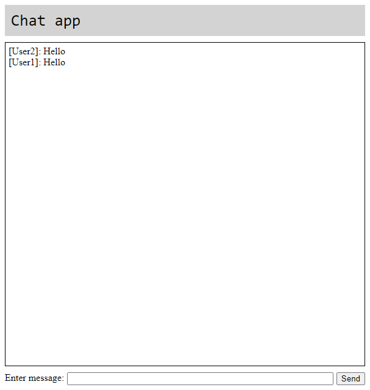

# Chat app

The simple chat application based on socket.io.

It consists of:

1. SvelteKit frontend (in `/frontend`)
2. Node.js backend for socket.io servet (in `/backend`)

Implementation of all functionality in SvelteKit alone - TBD
